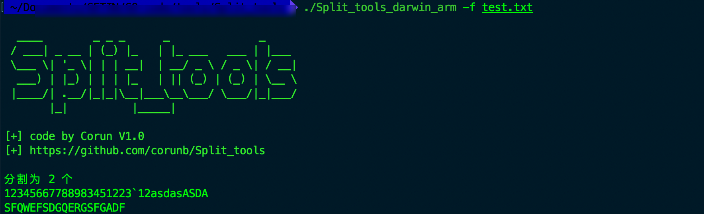
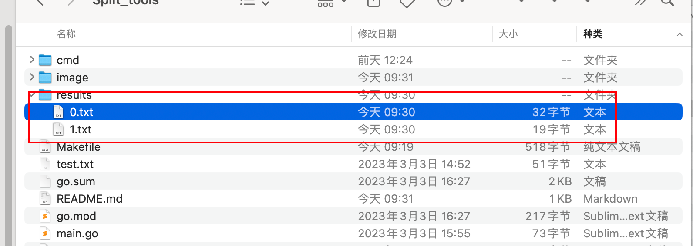
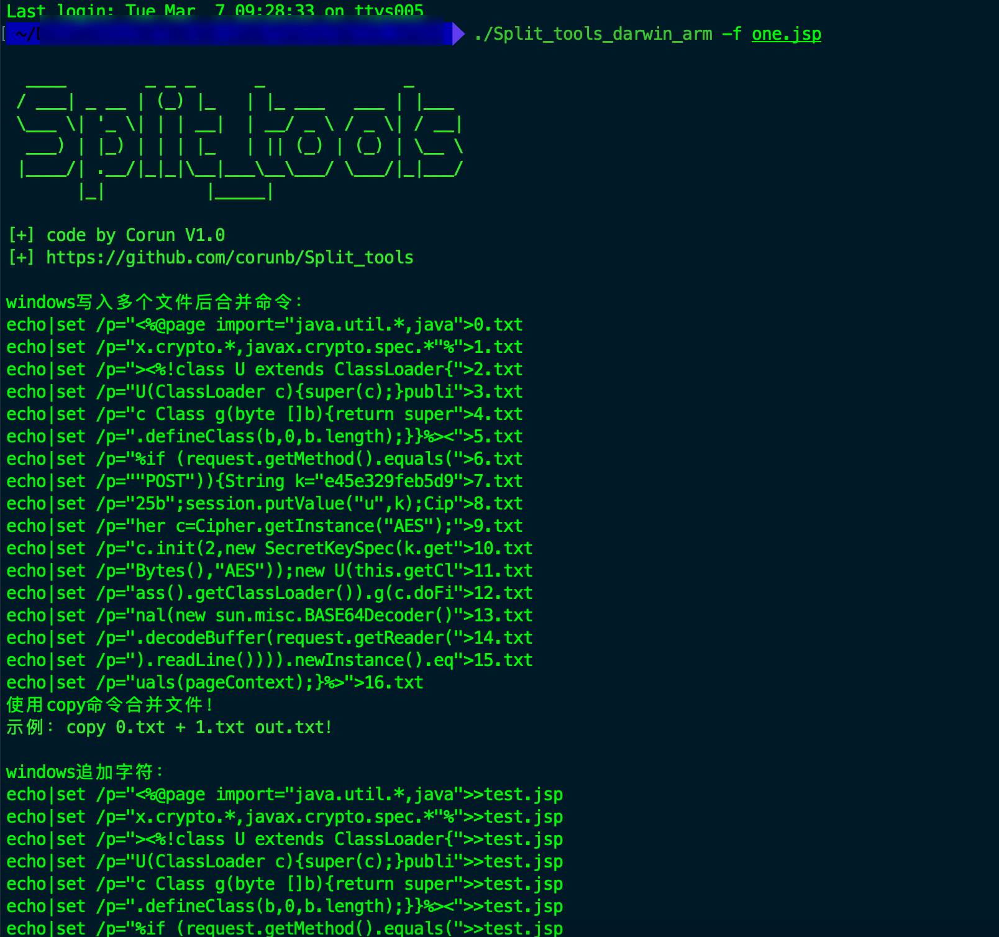

## 前言

​		每当获取一个命令执行，但是服务器不出网，不能进行远程下载，或者写木马有限制，命令长度也有限制的苛刻条件下，可使用该工具进行木马分割，一键生成写入命令和合并或者追加命令写入木马；

​		windows在苛刻条件下也可以分段写入文本，再合并写入二进制文件，具体可以与Certutil配合，将二进制文件转换为txt，再分段写入后合并还原二进制文件；

## 功能介绍

```
  -e string
        指定base64编码文件
  -f string
        指定分割的文本
  -n int
        设置长度进行切割，默认64 (default 64)

```

功能：

​	1、根据文件后缀进行分割：

```
当文件是txt时，会直接分割成几个txt
./Split_tools -f 1.txt

当文件是木马后缀时，会分割后生成写入命令
./Split_tools -f 1.jsp
```

分割txt:






分割木马：



​	2、可设置分割的长度

```
./Split_tools -f 1.txt -n 64
```

​	3、可对文件进行base64编码
```
编码文件后，将生成./results/enbase64.txt文件
上传编码文件后，结合certutil -decode xxx.txt xxx.exe命令进行还原；
```


## 更新记录：
```
[+] 2024.1.4 新增base64文件编码、输出分割命令文件
```

